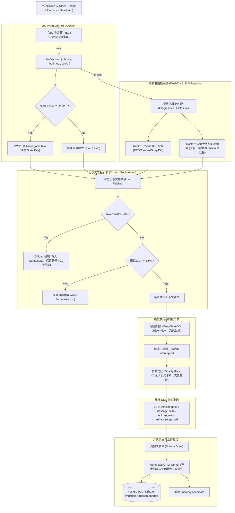
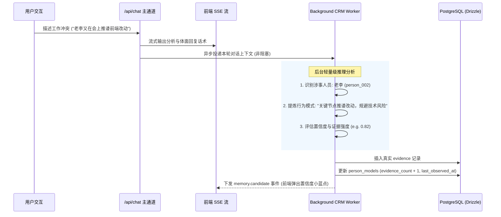

# PANGBAI（旁白）· 后端 Agent Harness 深度工程架构设计规范

> **标准版本**：v2.0.0 (Harness Engineering 深度演化版)  
> **设计基准**：严格贯彻《Harness Engineering 企业级多 Agent 协同实战》（马士兵/DeepAgents）与 DeepSeek Harness 架构方法论  
> **核心世界观**：$\text{Agent} = \text{Model} + \text{Harness}$；$\text{Harness Engineering} \supset \text{Context Engineering} \supset \text{Prompt Engineering}$。

---

## 目录
1. [一、 为什么必须彻底告别“传统简单 Agent”？](#一-为什么必须彻底告别传统简单-agent)
2. [二、 PANGBAI 整体 Harness 拓扑架构图](#二-pangbai-整体-harness-拓扑架构图)
3. [三、 Jev 决策层（TypeSafe Pre-Decision Layer）](#三-jev-决策层typesafe-pre-decision-layer)
4. [四、 双轨制技能系统（Dual-Track Skill Registry）与渐进式披露](#四-双轨制技能系统dual-track-skill-registry与渐进式披露)
5. [五、 上下文工程引擎（Context Engineering Engine）](#五-上下文工程引擎context-engineering-engine)
6. [六、 任务规划状态机（Planning & State Isolation）](#六-任务规划状态机planning--state-isolation)
7. [七、 流式质量门禁与契约拦截（Quality Gate & Format Interceptor）](#七-流式质量门禁与契约拦截quality-gate--format-interceptor)
8. [八、 异步人物画像抽取引擎（Workplace CRM Worker）](#八-异步人物画像抽取引擎workplace-crm-worker)
9. [九、 SSE 事件流协议与客户端流控生命周期](#九-sse-事件流协议与客户端流控生命周期)
10. [十、 目录规划与实现清单](#十-目录规划与实现清单)

---

## 一、 为什么必须彻底告别“传统简单 Agent”？

### 1.1 传统单体 Agent 的致命缺陷
在此前的实现（`src/app/api/chat/route.ts`）中，本质只是一个“带 Prompt 注入的 Chat 代理”，存在四大顽疾：
1. **上下文无序膨胀与状态丢失**：将干系人画像、系统设定、历史聊天全部机械打包丢给模型，没有分层控制与压缩机制；
2. **工具与技能混乱无门禁**：无法区分“用户是要写 PRD”还是“遇到了职场推诿想体面拒绝”，全凭模型大一统生成，常常出现“在正文假装说生成了 Canvas，实际画布根本未唤醒”的惨剧；
3. **缺乏 Planning 与自我纠错**：面对“复杂的三没说任务”（分析维度没说、数据来源没说、呈现形式没说），没有任务拆解与状态追踪，模型容易幻觉或死循环；
4. **硬编码伪进化**：在流结束用简单正则匹配人物并机械性 `confidence + 0.02`，写入假证据，破坏了因果证据链的真实性。

### 1.2 Harness Engineering 的核心世界观
- **模型是 CPU，Harness 是操作系统**：模型只负责语义推演与文本生成；决策路由、上下文按需加载、工具调度、记忆持久化、状态快照与安全沙箱全由 Harness 强管控。
- **上下文是最大的稀缺资源**：必须通过 **Load（加载）$\rightarrow$ Compress（压缩与 Offload）$\rightarrow$ Isolation（隔离）$\rightarrow$ Storage（长期存储）** 全生命周期管控。
- **任务规划绝不能进 messages**：任务清单（`todoList`）必须作为 Agent State 的独立 Key 存在，绝不能被上下文摘要压缩（Compact/Prune），否则 Agent 必产生失忆与流程偏离。

---

## 二、 PANGBAI 整体 Harness 拓扑架构图



---

## 三、 Jev 决策层（TypeSafe Pre-Decision Layer）

Jev 是置于主模型调用之前的**轻量级毫秒级决策中间件**，负责在模型动笔前完成意图分流与资源调配：

### 3.1 Jev 决策契约（Schema）
```typescript
export interface JevDecision {
  /** 命中的核心技能或直通模式 */
  choice: 
    | "prd_generator"            // 生成 PRD 需求文档
    | "canvas_doc_writer"         // 生成架构/复盘/方案 Canvas
    | "scope_diff_checker"        // 需求范围变更与膨胀审查
    | "user_story_expander"       // 用户故事与 AC 验收准则细化
    | "issue_breakdown_planner"   // 复杂技术/业务任务 WBS 拆解
    | "situation_analyzer_daming" // 《大明王朝》深度局势与权力推演
    | "tactful_reply_zhenhuan"    // 《甄嬛传》体面拒绝与借力打力话术
    | "upward_report_pyramid"     // 金字塔原理向上汇报与汇报提纲
    | "conflict_mediator"         // 跨部门推诿/冲突化解
    | "crm_person_profiler"       // 专门分析某人物特征与对策
    | "direct_chat";              // 普通问答，无需外挂技能

  /** 是否需要唤醒外挂工具/沙箱/数据库穿透 */
  need_tool: boolean;

  /** 
   * 任务复杂度与紧急度评分 (0 ~ 100)
   * >= 60: 触发任务规划引擎，生成 todoList 并维持状态机
   * < 60: 直接执行
   */
  score: number;

  /** 决策核心论据 (供 Prompt 注入与观测) */
  rationale: string;
}
```

### 3.2 复杂度“三个没说”判定准则
当用户输入符合以下特征时，Jev 评分自动打到 $\ge 60$：
1. **分析维度没说**：如“帮我分析一下这次排期冲突”，未说明是站在技术成本、业务价值、还是领导关系维度；
2. **数据来源没说**：如“评估一下这个竞品功能”，未指定是参考现有 PRD、外部公开竞品还是内部数据；
3. **呈现形式没说**：未明确只要两句建议，还是需要 PRD、对比表格、行动 Checklist 全套交付。

---

## 四、 双轨制技能系统（Dual-Track Skill Registry）与渐进式披露

PANGBAI 专为“既要出高质量文档、又要应对职场人情博弈”的产品经理设计，因此将 Skill 严格划分为两大业务集群：

### 4.1 Track 1：产品经理工作流 Skills（PM Workflow）
1. **`prd_generator`**：
   - 职责：输出标准 PRD 骨架，强制注入 YAML Frontmatter（`type: prd`），包含业务背景、用户场景、功能需求、非功能需求、风险点；
   - 触发信号：用户要求“出个 PRD”、“写个需求文档”、“把方案落成文档”。
2. **`canvas_doc_writer`**：
   - 职责：输出架构设计、排期规划、项目复盘 Canvas 活文档，包含 `expected_solution`；
   - 触发信号：“整理成方案”、“放到右侧画布”、“输出复盘总结”。
3. **`scope_diff_checker`**：
   - 职责：比对前后两个版本的变更，提示范围蔓延（Scope Creep）与插单风险；
   - 触发信号：“研发说需求改动太大”、“技术要砍需求”、“对比新旧版本”。
4. **`user_story_expander`**：
   - 职责：按照 INVEST 原则展开用户故事，编写 Given-When-Then 格式的验收标准（AC）；
   - 触发信号：“细化用例”、“写验收标准”、“拆用户故事”。
5. **`issue_breakdown_planner`**：
   - 职责：将模糊的大目标拆解为 WBS 任务清单（带前置依赖、负责人角色与交付物）。

### 4.2 Track 2：人情世故与职场博弈 Skills（Workplace Dynamics）
1. **`situation_analyzer_daming`（大明王朝局势分析法）**：
   - 职责：穿透“冠冕堂皇的借口”，分析各方利益链条、谁在甩锅、谁在自保、真正有决策权的人是谁；
   - 输出结构：【台面诉求】 vs 【水下博弈】 vs 【各方生死底线】。
2. **`tactful_reply_zhenhuan`（甄嬛传体面拒绝术）**：
   - 职责：提供既不伤和气、又绝不接锅的借力打力话术；
   - 输出约束：严格使用 `> "话术..."` 卡片格式输出，可一键复制。
3. **`upward_report_pyramid`（麦肯锡金字塔向上汇报）**：
   - 职责：向领导汇报工作或寻求资源支持时，坚持“结论先行、以上统下、归类分组、逻辑递进”；
   - 输出结构：【结论与请求】 $\rightarrow$ 【关键依据（三点）】 $\rightarrow$ 【备选方案与建议】。
4. **`conflict_mediator`（跨部门冲突与撕逼化解）**：
   - 职责：面对研发不给排期、业务方紧急插单、运营甩锅数据等恶性冲突时的降温与利益交换方案。
5. **`crm_person_profiler`（人物心智画像）**：
   - 职责：靶向分析某干系人的沟通偏好、雷区、利益诉求与历史信任度。

### 4.3 渐进式披露机制（Progressive Disclosure）
- **常驻阶段**：系统仅在上下文维护每个 Skill 的 Metadata（名称 + 一句话描述，单个 Skill $\le 200$ Tokens，10 个 Skill 仅占 $\approx 1500$ Tokens）；
- **激活阶段**：Jev 决策命中目标 Skill 后，**JIT（即时）加载**该 Skill 的完整 SOP 规则、强制输出契约与 Few-shot 样例，彻底避免上下文爆炸。

---

## 五、 上下文工程引擎（Context Engineering Engine）

上下文是 Harness 最昂贵的计算资源。PANGBAI 严格实现四大标准流程：

```
[Load 加载] ──> [Compress 压缩 / Offload 剪裁] ──> [Isolation 隔离] ──> [Storage 长期沉淀]
```

### 5.1 Load（启动时加载）
按 Token 预算动态拼装 Prompt：
1. **Base Philosophy + AGENT.md 铁律**（固定 $\approx 500$ Tokens）；
2. **User Preferences & Workspace Profile**（长期存储注入，$\approx 300$ Tokens）；
3. **Jev 决策结果 & 命中的 Skill SOP**（动态加载，$\approx 600$ Tokens）；
4. **靶向干系人世界模型（Drawer 1）**（优先加载当前输入提及的人，最多 3 人，$\approx 800$ Tokens）；
5. **Active Canvas TOC 切片（Drawer 3）**（仅加载大纲与聚焦段落，$\approx 800$ Tokens）。

### 5.2 Compress（压缩与剪裁机制）
1. **Offload（超长剪裁，阈值 20K Tokens）**：
   - 当单次工具返回或参考资料大于 20,000 Tokens 时，系统**自动将其写入独立临时文件（Scratchpad）**；
   - 上下文中仅保留：`[超长资料已归档至: /scratch/doc_xxx.md] 前 10 行预览如下...`，大模型需要深读时自主调阅。
2. **主动摘要（Active Summarization Middleware，主力）**：
   - 当多轮对话轮数超过 6 轮，或用户完成了“PRD 大纲敲定 $\rightarrow$ 开始细化功能”的重大阶段转变时，Agent 自主触发上下文摘要，提炼为结构化阶段备忘录。
3. **保底自动摘要（85% Context Fallback）**：
   - 当上下文占用达到模型总窗口的 85% 时，Harness 底层安全网自动拦截并强制压缩历史 messages，保留首尾关键轮次与 TodoList 状态，绝不允许 API 抛出 400 Context Overflow 异常。

---

## 六、 任务规划状态机（Planning & State Isolation）

### 6.1 状态隔离铁律
> **任务清单绝不能进 messages！**

```typescript
export interface AgentState {
  sessionId: string;
  projectId?: string;
  /** 
   * 独立的任务清单状态 Key，与 messages 严格物理隔离！
   * 任何上下文摘要/剪裁机制均不可触碰该 Key！
   */
  todoList: Array<{
    id: string;
    task: string;
    status: "pending" | "in_progress" | "completed" | "failed";
    deliverable?: string;
  }>;
  /** 活跃技能 */
  activeSkill?: string;
  /** 复杂度判定分 */
  complexityScore: number;
}
```

### 6.2 动态重规划（Replanning）
如果子任务在执行时由于输入不完整、或者上游干系人信息缺失导致失败，Harness 允许在保留已完成步骤的前提下，动态调整 `todoList` 后续步骤并重试，而不是让整个会话崩溃。

---

## 七、 流式质量门禁与契约拦截（Quality Gate & Format Interceptor）

为了彻底杜绝模型“口头承诺在右侧生成，实际啥也没出”或“乱用引用语法导致前端渲染崩溃”，Harness 实施三道质量门禁：

| 门禁类型 | 校验规则 | 违规修正动作 |
|---|---|---|
| **Canvas YAML 门禁** | 当命中文档类技能（`prd_generator` / `canvas_doc_writer`）时，正文头部必须包含标准的 `--- ... ---` YAML Frontmatter | 若模型遗漏或格式损坏，拦截器自动补全 Frontmatter 头部并补齐 `type` 与 `title` |
| **引用卡片门禁** | `> "..."` 语法**仅且只能**用于输出“可直接复制给领导/同事的沟通话术” | 若模型在 `>` 中输出导师自己的寒暄或大段分析，拦截器剥离 `>` 符号降级为普通正文 |
| **实体超链门禁** | 提到数据库中已有人物必须使用 `[姓名](person:ID)`，提到历史事件必须使用 `[事件描述](evidence:ID)` | 拦截器根据上下文中的实体字典，自动回填 Markdown 超链接，确保前端可点击穿透 |

---

## 八、 异步人物画像抽取引擎（Workplace CRM Worker）

彻底废除原本脆弱的 `confidence + 0.02` 正则硬编码，采用真后台语义抽取：



---

## 九、 SSE 事件流协议与客户端流控生命周期

为无缝兼容前端现有的 `SSETransport` 与 `AgentSession`，后端必须输出规范的标准 SSE 流（`text/event-stream`）：

```
event: run.started
data: {"type":"run.started","sessionId":"sess_123","messageId":"msg_456"}

event: thinking.delta
data: {"type":"thinking.delta","delta":"正在分析干系人老李的潜在顾虑与技术背景..."}

event: tool.started
data: {"type":"tool.started","toolCallId":"tc_001","toolName":"prd_generator","input":{"title":"用户增长裂变PRD"}}

event: message.delta
data: {"type":"message.delta","delta":"针对您目前遇到的排期被压情况，建议按照以下策略应对：\n\n"}

event: artifact.suggested
data: {"type":"artifact.suggested","title":"用户增长裂变方案.md","artifactType":"prd","content":"---\ntitle: ..."}

event: memory.candidate
data: {"type":"memory.candidate","personId":"person_002","personName":"老李","pattern":"排期防御型人格","confidence":0.85,"observation":"在评审会上强调工期不足拒绝新增埋点需求"}

event: run.finished
data: {"type":"run.finished","usage":{"promptTokens":1420,"completionTokens":680,"totalTokens":2100}}
```


---

## 十、 事实录入与 Harness 反思管线（Fact Ingestion Pipeline）

Agent 再智能，如果没有原始事实素材（群聊记录、会议纪要、研发对齐纪要），就是在编造。PANGBAI 采用 Harness 工程范式处理事实录入：**不是传统 CRUD "存完就完"，而是每条原始素材落库后自动触发异步 Harness 反思管线**。

### 10.1 四类事实源与录入协议

| 事实类型 | API 端点 | 录入内容 | 触发的 Harness 反思 |
|---|---|---|---|
| **群聊/私聊记录** | `POST /api/events` `type: "chat"` | 原始聊天文本、聊天类型（group/private）、涉及人 | 自动识别干系人 → 提炼行为模式 → 沉淀 evidence → 关联项目 |
| **MT+1 会议纪要** | `POST /api/events` `type: "meeting"` | 会议主题、参会人、结论、Action Items | 提取待办 → 更新项目里程碑/风险 → 补全干系人画像 |
| **研发对接记录** | `POST /api/events` `type: "review"` | 技术评审反馈、排期确认/砍需求、阻塞点 | 识别阻塞风险 → 更新 risks → 记录研发侧态度模式 |
| **职场突发事件** | `POST /api/events` `type: "incident"` | 冲突、甩锅、插单等一手描述 | 深度局势分析 → 高权重 evidence → 紧张度更新 |

### 10.2 上下文工程集成 (Drawer 4: 近期事实切片)

事实录入后通过 Context Engine 的 **Drawer 4** 按需注入：
- 按项目 ID 过滤，只加载最近 5 条事件
- 每条事件仅注入标题 + 摘要（<= 150 Tokens），避免膨胀
- 完整原文按需 Offload

---

## 十一、 目录规划与实现清单

```
src/server/harness/
├── jev-decision.ts              # [模块 1] Jev 毫秒级 TypeSafe 决策前置层
├── skill-registry.ts            # [模块 2] 双轨制技能注册表与渐进式披露元数据
├── context-engine.ts            # [模块 3] 上下文工程引擎 (Drawer 0~4 + Offload + 摘要)
├── planning-state.ts            # [模块 4] 独立 Planning 状态机 (todoList 隔离存储)
├── quality-gate.ts              # [模块 5] 流式质量门禁 (YAML / 引用卡片 / 实体链接修复)
├── workplace-crm-worker.ts      # [模块 6] 异步真实人物画像提取与记忆候选下发
├── event-ingestion-worker.ts    # [模块 7] 事实录入 Harness 反思管线
└── index.ts                     # [统一导出] Harness 主入口与编排器

src/app/api/
├── events/
│   ├── route.ts                 # GET (列表) + POST (录入群聊/会议/评审/事件)
│   └── [id]/route.ts            # GET (单条详情) + DELETE
├── projects/
│   └── route.ts                 # GET + POST (扩展: milestones/stakeholders/risks 完整初始化)
└── chat/
    └── route.ts                 # Harness 主通道
```

---

## 十二、 飞书（Feishu CLI & Skill）与 Jev 决策层双重身份集成架构

### 12.1 Jev 官方 System One 决策层深度接入
系统已废弃本地粗糙正则，直接通过 TypeSafe 官方 System One 决策 API (`POST https://api.typesafe.ai/v1/systemone`) 进行强类型判定：
- `choice`: 从 11 项双轨技能（PRD、Canvas、局势分析、甄嬛借力打力、飞书同步等）中完成纳秒级路由；
- `is_complex`: 返回连续概率值计算任务复杂度分值；
- `need_tool`: 自动识别是否需调用飞书同步或数据库工具。

### 12.2 飞书双重身份接入模型（Bot vs User OAuth）

飞书官方维护的 `lark-cli` 是专为 Humans + AI Agents 打造的核心基础设施。在 PANGBAI 架构中，系统正式确立**双重身份访问模型**：

```
[模式 A: Bot 机器人模式]
飞书开放平台 → tenant_access_token → 受 Bot 进群范围限制 → 公共产研群讨论

[模式 B: User 最终用户 OAuth 模式 (突破性能力)]
飞书 OAuth 登录 → user_access_token (--as user)
  ├── 访问本人所有 P2P 单聊（1:1 私聊对齐）
  ├── 访问本人有权限的所有私密小群
  └── 跨会话全局消息搜索 (+messages-search)
```

| 维度 | Bot 身份模式 (`--as bot`) | User 身份模式 (`--as user`) |
|---|---|---|
| **鉴权凭据** | `tenant_access_token` (App ID + App Secret) | `user_access_token` (Device Flow OAuth 授权) |
| **P2P 单聊/私聊** | ❌ 无法读取个人之间的私聊 | ✅ 完整支持 (`+chat-list --types=p2p,group --as user`) |
| **群聊范围** | 仅限 Bot 被主动拉入的群聊 | 用户本人所有可见群聊 |
| **历史消息搜索** | 仅限单一会话 | 支持跨会话全局搜索 (`+messages-search`) |
| **典型应用场景** | 团队公共周会结论、产研大群沟通同步 | 关键干系人私聊排期博弈、领导一对一指导、私下利益摸底 |

### 12.3 飞书素材直接接入 Harness 事实反思管线
通过 `POST /api/feishu/sync`，无论是群聊还是 P2P 单聊，均会自动被格式化为标准对话时间线，一键输入 `runEventIngestionPipeline`，完成人物画像自动建档、行为模式归纳、会议待办与排期风险提取。
