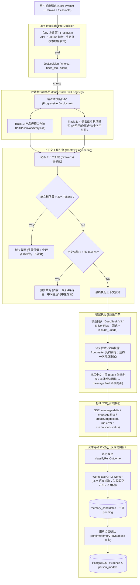
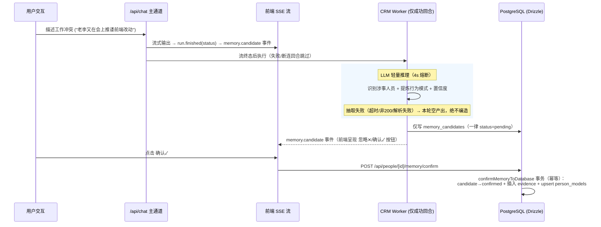

# PANGBAI（旁白）· 后端 Agent Harness 深度工程架构设计规范

> **标准版本**：v2.1.0 (2026-09-27 诚实化对齐版：本文档已逐节对齐实现，未实现的能力显式标注【路线图，未实现】)  
> **设计基准**：严格贯彻《Harness Engineering 企业级多 Agent 协同实战》（马士兵/DeepAgents）与 DeepSeek Harness 架构方法论  
> **核心世界观**：$\text{Agent} = \text{Model} + \text{Harness}$；$\text{Harness Engineering} \supset \text{Context Engineering} \supset \text{Prompt Engineering}$。  
> **对照阅读**：`docs/harness-analysis.md` 为代码现状分析，两者冲突时以代码为准。

---

## 目录
1. [一、 为什么必须彻底告别“传统简单 Agent”？](#一-为什么必须彻底告别传统简单-agent)
2. [二、 PANGBAI 整体 Harness 拓扑架构图](#二-pangbai-整体-harness-拓扑架构图)
3. [三、 Jev 决策层（TypeSafe Pre-Decision Layer）](#三-jev-决策层typesafe-pre-decision-layer)
4. [四、 双轨制技能系统（Dual-Track Skill Registry）与渐进式披露](#四-双轨制技能系统dual-track-skill-registry与渐进式披露)
5. [五、 上下文工程引擎（Context Engineering Engine）](#五-上下文工程引擎context-engineering-engine)
6. [六、 任务规划状态机——已移除](#六-任务规划状态机planning--state-isolation已移除)
7. [七、 流式质量门禁与契约拦截（Quality Gate & Format Interceptor）](#七-流式质量门禁与契约拦截quality-gate--format-interceptor)
8. [八、 异步人物画像抽取引擎（Workplace CRM Worker）](#八-异步人物画像抽取引擎workplace-crm-worker)
9. [九、 SSE 事件流协议与客户端流控生命周期](#九-sse-事件流协议与客户端流控生命周期)
10. [十、 目录规划与实现清单](#十-目录规划与实现清单)

---

## 一、 为什么必须彻底告别“传统简单 Agent”？

### 1.1 传统单体 Agent 的致命缺陷
在此前的实现（`src/app/api/chat/route.ts`）中，本质只是一个“带 Prompt 注入的 Chat 代理”，存在四大顽疾：
1. **上下文无序膨胀与状态丢失**：将干系人画像、系统设定、历史聊天全部机械打包丢给模型，没有分层控制与压缩机制；
2. **工具与技能混乱无门禁**：无法区分“用户是要写 PRD”还是“遇到了职场推诿想体面拒绝”，全凭模型大一统生成，常常出现“在正文假装说生成了 Canvas，实际画布根本未唤醒”的惨剧；
3. **缺乏 Planning 与自我纠错**：面对“复杂的三没说任务”（分析维度没说、数据来源没说、呈现形式没说），没有任务拆解与状态追踪，模型容易幻觉或死循环；
4. **硬编码伪进化**：在流结束用简单正则匹配人物并机械性 `confidence + 0.02`，写入假证据，破坏了因果证据链的真实性。

### 1.2 Harness Engineering 的核心世界观
- **模型是 CPU，Harness 是操作系统**：模型只负责语义推演与文本生成；决策路由、上下文按需加载、工具调度、记忆持久化、状态快照与安全沙箱全由 Harness 强管控。
- **上下文是最大的稀缺资源**：必须通过 **Load（加载）$\rightarrow$ Compress（压缩与 Offload）$\rightarrow$ Isolation（隔离）$\rightarrow$ Storage（长期存储）** 全生命周期管控。
- **任务规划绝不能进 messages**：任务清单（`todoList`）必须作为 Agent State 的独立 Key 存在，绝不能被上下文摘要压缩（Compact/Prune），否则 Agent 必产生失忆与流程偏离。

---

## 二、 PANGBAI 整体 Harness 拓扑架构图


```mermaid
flowchart TD
    UserReq["用户前端请求 (User Prompt + Canvas + SessionId)"] --> JevLayer["【Jev 决策层】(TypeSafe API · 1200ms 熔断 · 失败降级本地启发式)"]
    
    subgraph JevEngine ["Jev TypeSafe Pre-Decision"]
        JevLayer --> |eval| DecisionRes["JevDecision { choice, need_tool, score }"]
    end

    subgraph SkillRegistry ["双轨制技能系统 (Dual-Track Skill Registry)"]
        DecisionRes --> |choice| SkillMatch["渐进式技能匹配 (Progressive Disclosure)"]
        SkillMatch --> Track1["Track 1: 产品经理工作流 (PRD/Canvas/Story/Diff)"]
        SkillMatch --> Track2["Track 2: 人情世故与职场博弈 (大明王朝/甄嬛传/金字塔汇报)"]
    end

    subgraph ContextEngine ["上下文工程引擎 (Context Engineering)"]
        Track1 --> Assemble["动态上下文加载 (Drawer 分层装配)"]
        Track2 --> Assemble
        
        Assemble --> TokenBudget{"单文档估算 > 20K Tokens ?"}
        TokenBudget -- Yes --> Truncate["诚实截断 (头尾保留 + 中段省略标注，不落盘)"]
        TokenBudget -- No --> WindowBudget{"历史估算 > 12K Tokens ?"}
        WindowBudget -- Yes --> Prune["预算裁剪 (首轮 + 最新4条保留，中间轮逐轮中性存根)"]
        WindowBudget -- No --> ContextReady["最终执行上下文就绪"]
    end

    subgraph ExecutionGate ["模型执行与质量门禁"]
        ContextReady --> LLMGateway["模型网关 (DeepSeek-V3 / SiliconFlow，流式 + include_usage)"]
        LLMGateway --> HeadGate["流头拦截 (文档技能 frontmatter 契约判定；违约一次修正重试)"]
        HeadGate --> QualityGate["流后全文门禁 (quote 前缀剥离 / 实体超链回填 → message.final 终稿同步)"]
    end

    subgraph SSEStream ["标准 SSE 流式推送"]
        QualityGate --> SSE_Events["SSE: message.delta / message.final / artifact.suggested / run.error / run.finished(status)"]
    end

    subgraph BackgroundWorker ["反思与活体记忆（仅成功回合）"]
        SSE_Events --> Outcome["终态裁决 classifyRunOutcome"]
        Outcome --> CRMWorker["Workplace CRM Worker (LLM 语义抽取；失败即空产出，不编造)"]
        CRMWorker --> PendingCand[(memory_candidates · 一律 pending)]
        PendingCand --> Confirm["用户点击确认 (confirmMemoryToDatabase 事务)"]
        Confirm --> EvidenceDB[(PostgreSQL: evidence & person_models)]
    end
```

---

## 三、 Jev 决策层（TypeSafe Pre-Decision Layer）

Jev 是置于主模型调用之前的**轻量级毫秒级决策中间件**，负责在模型动笔前完成意图分流与资源调配：

### 3.1 Jev 决策契约（Schema）
```typescript
export interface JevDecision {
  /** 命中的核心技能或直通模式 */
  choice: 
    | "prd_generator"            // 生成 PRD 需求文档
    | "canvas_doc_writer"         // 生成架构/复盘/方案 Canvas
    | "scope_diff_checker"        // 需求范围变更与膨胀审查
    | "user_story_expander"       // 用户故事与 AC 验收准则细化
    | "issue_breakdown_planner"   // 复杂技术/业务任务 WBS 拆解
    | "situation_analyzer_daming" // 《大明王朝》深度局势与权力推演
    | "tactful_reply_zhenhuan"    // 《甄嬛传》体面拒绝与借力打力话术
    | "upward_report_pyramid"     // 金字塔原理向上汇报与汇报提纲
    | "conflict_mediator"         // 跨部门推诿/冲突化解
    | "crm_person_profiler"       // 专门分析某人物特征与对策
    | "direct_chat";              // 普通问答，无需外挂技能

  /** 是否需要唤醒外挂工具/沙箱/数据库穿透 */
  need_tool: boolean;

  /** 
   * 任务复杂度评分 (0 ~ 100)
   * 注：score >= 60 曾触发任务规划状态机；该模块因实现为硬编码假进度已于 2026-09 移除
   */
  score: number;

  /** 决策核心论据 (供 Prompt 注入与观测) */
  rationale: string;
}
```

### 3.2 复杂度“三个没说”判定准则
当用户输入符合以下特征时，Jev 评分自动打到 $\ge 60$：
1. **分析维度没说**：如“帮我分析一下这次排期冲突”，未说明是站在技术成本、业务价值、还是领导关系维度；
2. **数据来源没说**：如“评估一下这个竞品功能”，未指定是参考现有 PRD、外部公开竞品还是内部数据；
3. **呈现形式没说**：未明确只要两句建议，还是需要 PRD、对比表格、行动 Checklist 全套交付。

---

## 四、 双轨制技能系统（Dual-Track Skill Registry）与渐进式披露

PANGBAI 专为“既要出高质量文档、又要应对职场人情博弈”的产品经理设计，因此将 Skill 严格划分为两大业务集群：

### 4.1 Track 1：产品经理工作流 Skills（PM Workflow）
1. **`prd_generator`**：
   - 职责：输出标准 PRD 骨架，强制注入 YAML Frontmatter（`type: prd`），包含业务背景、用户场景、功能需求、非功能需求、风险点；
   - 触发信号：用户要求“出个 PRD”、“写个需求文档”、“把方案落成文档”。
2. **`canvas_doc_writer`**：
   - 职责：输出架构设计、排期规划、项目复盘 Canvas 活文档，包含 `expected_solution`；
   - 触发信号：“整理成方案”、“放到右侧画布”、“输出复盘总结”。
3. **`scope_diff_checker`**：
   - 职责：比对前后两个版本的变更，提示范围蔓延（Scope Creep）与插单风险；
   - 触发信号：“研发说需求改动太大”、“技术要砍需求”、“对比新旧版本”。
4. **`user_story_expander`**：
   - 职责：按照 INVEST 原则展开用户故事，编写 Given-When-Then 格式的验收标准（AC）；
   - 触发信号：“细化用例”、“写验收标准”、“拆用户故事”。
5. **`issue_breakdown_planner`**：
   - 职责：将模糊的大目标拆解为 WBS 任务清单（带前置依赖、负责人角色与交付物）。

### 4.2 Track 2：人情世故与职场博弈 Skills（Workplace Dynamics）
1. **`situation_analyzer_daming`（大明王朝局势分析法）**：
   - 职责：穿透“冠冕堂皇的借口”，分析各方利益链条、谁在甩锅、谁在自保、真正有决策权的人是谁；
   - 输出结构：【台面诉求】 vs 【水下博弈】 vs 【各方生死底线】。
2. **`tactful_reply_zhenhuan`（甄嬛传体面拒绝术）**：
   - 职责：提供既不伤和气、又绝不接锅的借力打力话术；
   - 输出约束：严格使用 `> "话术..."` 卡片格式输出，可一键复制。
3. **`upward_report_pyramid`（麦肯锡金字塔向上汇报）**：
   - 职责：向领导汇报工作或寻求资源支持时，坚持“结论先行、以上统下、归类分组、逻辑递进”；
   - 输出结构：【结论与请求】 $\rightarrow$ 【关键依据（三点）】 $\rightarrow$ 【备选方案与建议】。
4. **`conflict_mediator`（跨部门冲突与撕逼化解）**：
   - 职责：面对研发不给排期、业务方紧急插单、运营甩锅数据等恶性冲突时的降温与利益交换方案。
5. **`crm_person_profiler`（人物心智画像）**：
   - 职责：靶向分析某干系人的沟通偏好、雷区、利益诉求与历史信任度。

### 4.3 渐进式披露机制（Progressive Disclosure）
- **常驻阶段**：系统仅在上下文维护每个 Skill 的 Metadata（名称 + 一句话描述，单个 Skill $\le 200$ Tokens，10 个 Skill 仅占 $\approx 1500$ Tokens）；
- **激活阶段**：Jev 决策命中目标 Skill 后，**JIT（即时）加载**该 Skill 的完整 SOP 规则、强制输出契约与 Few-shot 样例，彻底避免上下文爆炸。

---

## 五、 上下文工程引擎（Context Engineering Engine）

上下文是 Harness 最昂贵的计算资源。PANGBAI 严格实现四大标准流程：

```
[Load 加载] ──> [Compress 压缩 / Offload 剪裁] ──> [Isolation 隔离] ──> [Storage 长期沉淀]
```

### 5.1 Load（启动时加载）
按 Token 预算动态拼装 Prompt：
1. **Base Philosophy + AGENT.md 铁律**（固定 $\approx 500$ Tokens）；
2. **User Preferences & Workspace Profile**（长期存储注入，$\approx 300$ Tokens）；
3. **Jev 决策结果 & 命中的 Skill SOP**（动态加载，$\approx 600$ Tokens）；
4. **靶向干系人世界模型（Drawer 1）**（优先加载当前输入提及的人，最多 3 人，$\approx 800$ Tokens）；
5. **Active Canvas TOC 切片（Drawer 3）**（仅加载大纲与聚焦段落，$\approx 800$ Tokens）。

### 5.2 Compress（压缩与剪裁机制）
1. **诚实截断（单文档预算，阈值 20K Tokens 估算）**：
   - 当单个文档（目前仅 Drawer 3 的 Canvas 活文档）估算超过 20,000 Tokens 时，保留头部 40 行 + 尾部 20 行，中段以显式标注省略（`中段约 N 行已省略，未做任何摘要归纳`）；
   - 不落盘临时文件——模型没有工具能把落盘内容读回来，"自主调阅"不会发生。
2. **历史预算裁剪（Prune，阈值 12K Tokens 估算）**：
   - 历史消息估算超预算时，保留首轮背景 + 最新 4 条，中间轮替换为**逐轮中性存根**（每轮前 40 字符 + "不代表任何共识"声明）；
   - 不使用固定文案宣称"已达成共识"——那是对模型的欺骗。
3. **估算器**：CJK 感知启发式（中日韩 1 token/字，其余 4 字符/token）；trace 侧优先记录 provider 经 `stream_options.include_usage` 返回的真实 usage。
4. **客户端历史**：assistant 历史发送真实正文（每轮截断 500 字符），不再压成固定占位串。

【路线图，未实现】阶段转变触发的自主摘要（Active Summarization）、模型窗口占比探测的动态水位。

---

## 六、 任务规划状态机（Planning & State Isolation）——已移除

**状态：已移除（2026-09）。** 曾实现的 `planning-state.ts` 存在不可接受的诚实性问题：
`generateInitialTodoList` 以 `void userQuery` 丢弃用户输入、返回按技能硬编码的模板，且
`step_1` 恒为 `completed`、`step_2` 恒为 `in_progress`——这是伪造的进度，不是规划；
`PLANNING_STORE` 为模块级内存 Map，唯一外部引用是 chat 路由的一次写入，从不读回，
重启即失；todoList 无任何 SSE 事件或 UI 消费者，仅注入 prompt 对模型撒谎。

原设计文档宣称的以下能力均为【路线图，未实现】，待有真实执行通道（多步工具调用）时再评估：
- 任务清单作为 Agent State 独立 Key 隔离存储；
- 子任务失败后在保留已完成步骤的前提下动态调整后续步骤并重试（Replanning）。

PANGBAI 当前是无状态单发建议者，回合内没有可被规划的"执行"——删除假进度比保留摆设更诚实。

---

## 七、 流式质量门禁与契约拦截（Quality Gate & Format Interceptor）

为了彻底杜绝模型“口头承诺在右侧生成，实际啥也没出”或“乱用引用语法导致前端渲染崩溃”，Harness 实施四道质量门禁：

| 门禁类型 | 时机 | 校验规则 | 违规修正动作 |
|---|---|---|---|
| **流头拦截（headGateCheck）** | 流式最初几个 delta 内 | 文档技能输出的去空白首部必须可能构成 `---\n` 分隔行 | 判定不可补全 → 取消上游 → **携带修正指令重试一次**（违约文本不触达用户）；重试仍违约 → 回退合成修复，终态记 `gate_retry_exhausted` |
| **Canvas YAML 门禁** | 流结束后 | frontmatter 必须以 `FRONTMATTER_RE`（单一事实源，与服务端 parseFrontmatter、客户端 block-parser 同一正则）锚定全文开头 | 缺失 → 从正文标题合成最小合规头；**存在于但不在文首 → 原块迁移至文首**（不丢弃模型真实元数据） |
| **引用卡片门禁** | 流结束后 | `>` 块不得以"我认为/我的建议是/首先/总的来说，"等导师分析前缀开头 | 剥离前缀词，保留话术本体 |
| **实体超链门禁** | 流结束后 | 已知人物出现处应使用 `[姓名](person:ID)` | 按 people 表字典回填超链 |

**终稿同步**：门禁改写文本后下发 `message.final` 事件（权威全文），客户端重置累积文本重新解析——保证**用户所见 == 落库文本 == artifact 内容**，三者永不分叉。

**结构化报告**：`processOutput` 返回 `{ text, report: { violations, repairs, retried } }`，随 `tool.result`、`run.finished.metadata.gate`、`llmCallTraces.metadataJson` 全链路留底。

---

## 八、 人物画像抽取引擎（Workplace CRM Worker）

彻底废除脆弱的 `confidence + 0.02` 正则硬编码与人名命中即编造证据的兜底，采用真后台语义抽取 + **用户确认闸门**：


```mermaid
sequenceDiagram
    participant User as 用户交互
    participant Route as /api/chat 主通道
    participant SSE as 前端 SSE 流
    participant Worker as CRM Worker (仅成功回合)
    participant DB as PostgreSQL (Drizzle)

    User->>Route: 描述工作冲突 ("老李又在会上推诿前端改动")
    Route->>SSE: 流式输出 → run.finished(status) → memory.candidate 事件
    Route->>Worker: 流终态后执行（失败/断连回合跳过）
    
    rect rgb(240, 248, 255)
    Note over Worker: LLM 轻量推理（4s 熔断）
    Worker->>Worker: 识别涉事人员 + 提炼行为模式 + 置信度
    Note over Worker: 抽取失败（超时/非200/解析失败）→ 本轮空产出，绝不编造
    end

    Worker->>DB: 仅写 memory_candidates（一律 status=pending）
    Worker-->>SSE: memory.candidate 事件（前端呈现 忽略✕/确认✓ 按钮）

    User->>SSE: 点击 确认✓
    SSE->>DB: POST /api/people/[id]/memory/confirm
    DB->>DB: confirmMemoryToDatabase 事务（幂等）：<br/>candidate→confirmed + 插入 evidence + upsert person_models
```

**纪律**：确认前不写任何 evidence / person_models——UI 的确认按钮是唯一晋升入口，不是摆设。代价是用户不确认则世界模型不生长，这是有意的产品取舍。

---

## 九、 SSE 事件流协议与客户端流控生命周期

后端输出标准 SSE 流（`text/event-stream`）。关键语义：

- **终态语义**：`run.finished` 携带 `status`（success/aborted/failed）与 `finishReason`；失败回合先发 `run.error` 再发 `run.finished`。idle ≠ turn success。
- **终稿同步**：门禁改写文本后下发 `message.final`（权威全文），客户端以终稿替换累积 delta。
- **顺序**：`memory.candidate` 事件在 `run.finished` **之后**下发（CRM 反思不阻塞终态事件）。

```
event: run.started
data: {"type":"run.started","sessionId":"sess_123","messageId":"msg_456"}

event: tool.started
data: {"type":"tool.started","toolCallId":"tc_001","toolName":"prd_generator","input":{"score":85}}

event: message.delta
data: {"type":"message.delta","messageId":"msg_456","delta":"---\ntitle: \"方案.md\"\n---\n"}

event: message.final
data: {"type":"message.final","messageId":"msg_456","text":"---\ntitle: \"方案.md\"\n---\n全文（门禁后权威版）"}

event: artifact.suggested
data: {"type":"artifact.suggested","title":"方案.md","artifactType":"prd","content":"---\ntitle: ..."}

event: tool.result
data: {"type":"tool.result","toolCallId":"tc_001","status":"success","output":{"skill":"prd_generator","gate":{"violations":[],"repairs":[],"retried":false}}}

event: run.finished
data: {"type":"run.finished","status":"success","finishReason":"stop","usage":{"promptTokens":1420,"completionTokens":680,"totalTokens":2100},"metadata":{"gate":{...}}}

event: memory.candidate
data: {"type":"memory.candidate","personId":"person_002","personName":"老李","pattern":"排期防御型人格","confidence":0.85,"observation":"在评审会上强调工期不足拒绝新增埋点需求"}

失败回合示例：
event: run.error
data: {"type":"run.error","error":"上游模型返回了空回复","code":"EMPTY_REPLY"}
event: run.finished
data: {"type":"run.finished","status":"failed","finishReason":"empty_reply","usage":{...}}
```


---

## 十、 事实录入与 Harness 反思管线（Fact Ingestion Pipeline）

Agent 再智能，如果没有原始事实素材（群聊记录、会议纪要、研发对齐纪要），就是在编造。PANGBAI 采用 Harness 工程范式处理事实录入：**不是传统 CRUD "存完就完"，而是每条原始素材落库后自动触发异步 Harness 反思管线**。

### 10.1 四类事实源与录入协议

| 事实类型 | API 端点 | 录入内容 | 触发的 Harness 反思 |
|---|---|---|---|
| **群聊/私聊记录** | `POST /api/events` `type: "chat"` | 原始聊天文本、聊天类型（group/private）、涉及人 | 自动识别干系人 → 提炼行为模式 → 沉淀 evidence → 关联项目 |
| **MT+1 会议纪要** | `POST /api/events` `type: "meeting"` | 会议主题、参会人、结论、Action Items | 提取待办 → 更新项目里程碑/风险 → 补全干系人画像 |
| **研发对接记录** | `POST /api/events` `type: "review"` | 技术评审反馈、排期确认/砍需求、阻塞点 | 识别阻塞风险 → 更新 risks → 记录研发侧态度模式 |
| **职场突发事件** | `POST /api/events` `type: "incident"` | 冲突、甩锅、插单等一手描述 | 深度局势分析 → 高权重 evidence → 紧张度更新 |

### 10.2 上下文工程集成 (Drawer 4: 近期事实切片)

事实录入后通过 Context Engine 的 **Drawer 4** 按需注入：
- 按项目 ID 过滤，只加载最近 5 条事件
- 每条事件仅注入标题 + 摘要（200 字符预览），避免膨胀

---

## 十一、 目录规划与实现清单

```
src/server/harness/
├── jev-decision.ts              # [模块 1] Jev TypeSafe 决策前置层 (1200ms 熔断 → 启发式降级；密钥仅从环境变量读取)
├── skill-registry.ts            # [模块 2] 双轨制技能注册表与渐进式披露元数据
├── context-engine.ts            # [模块 3] 上下文工程引擎 (Drawer 分层装配 + 诚实截断 + 中性存根裁剪)
├── quality-gate.ts              # [模块 4] 流头拦截 + 流后全文门禁 (契约对齐 / 修正重试 / 结构化报告)
├── workplace-crm-worker.ts      # [模块 5] 人物画像提取；一律 pending 候选，确认事务才落 evidence
├── event-ingestion-worker.ts    # [模块 6] 事实录入 Harness 反思管线
├── tokens.ts                    # [模块 7] CJK 感知 token 估算器
├── run-outcome.ts               # [模块 8] 运行终态分类器 (idle != turn success)
├── sse-emitter.ts               # [模块 9] SSE 安全发射器 (断连吞错，防异常穿透 start())
└── index.ts                     # [统一导出] Harness 主入口
# 注：planning-state.ts 已移除（见第六节）

src/app/api/
├── events/
│   ├── route.ts                 # GET (列表) + POST (录入群聊/会议/评审/事件)
│   └── [id]/route.ts            # GET (单条详情) + DELETE
├── projects/
│   └── route.ts                 # GET + POST
└── chat/
    └── route.ts                 # Harness 主通道 (终态语义 + 流头门禁 + 断连级联 + 真实 usage)
```

---

## 十二、 飞书（Feishu CLI & Skill）与 Jev 决策层双重身份集成架构

### 12.1 Jev 官方 System One 决策层接入
优先通过 TypeSafe 官方 System One 决策 API (`POST https://api.typesafe.ai/v1/systemone`) 判定，**1200ms 熔断**；API 不可用（超时/非 200/未配置 `JEV_API_KEY`）时降级为本地正则启发式路由（`evaluateHeuristic`），两者共存而非替代关系。密钥仅从环境变量读取，缺失时 warn-once 后直接走启发式，无内置兜底密钥。

### 12.2 飞书双重身份接入模型（Bot vs User OAuth）【路线图，未实现】

飞书官方维护的 `lark-cli` 是专为 Humans + AI Agents 打造的核心基础设施。在 PANGBAI 架构中，系统正式确立**双重身份访问模型**：

```
[模式 A: Bot 机器人模式]
飞书开放平台 → tenant_access_token → 受 Bot 进群范围限制 → 公共产研群讨论

[模式 B: User 最终用户 OAuth 模式 (突破性能力)]
飞书 OAuth 登录 → user_access_token (--as user)
  ├── 访问本人所有 P2P 单聊（1:1 私聊对齐）
  ├── 访问本人有权限的所有私密小群
  └── 跨会话全局消息搜索 (+messages-search)
```

| 维度 | Bot 身份模式 (`--as bot`) | User 身份模式 (`--as user`) |
|---|---|---|
| **鉴权凭据** | `tenant_access_token` (App ID + App Secret) | `user_access_token` (Device Flow OAuth 授权) |
| **P2P 单聊/私聊** | ❌ 无法读取个人之间的私聊 | ✅ 完整支持 (`+chat-list --types=p2p,group --as user`) |
| **群聊范围** | 仅限 Bot 被主动拉入的群聊 | 用户本人所有可见群聊 |
| **历史消息搜索** | 仅限单一会话 | 支持跨会话全局搜索 (`+messages-search`) |
| **典型应用场景** | 团队公共周会结论、产研大群沟通同步 | 关键干系人私聊排期博弈、领导一对一指导、私下利益摸底 |

### 12.3 飞书素材直接接入 Harness 事实反思管线【路线图，未实现】
通过 `POST /api/feishu/sync`，无论是群聊还是 P2P 单聊，均会自动被格式化为标准对话时间线，一键输入 `runEventIngestionPipeline`，完成人物画像自动建档、行为模式归纳、会议待办与排期风险提取。
